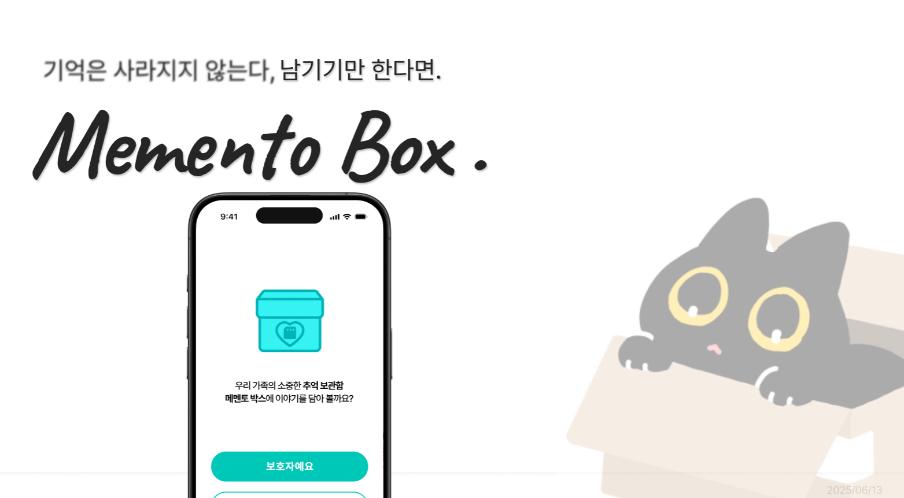
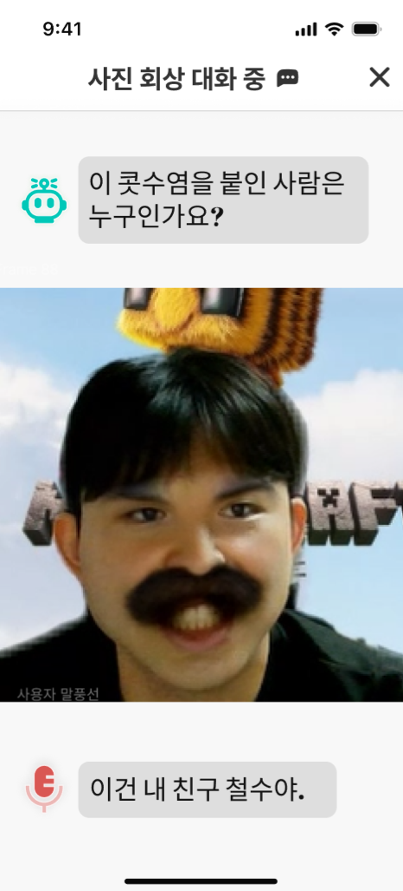
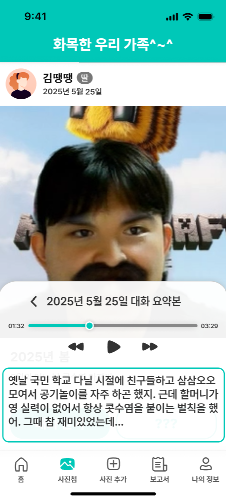
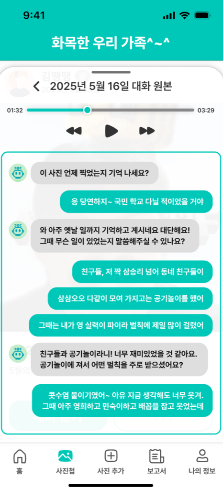
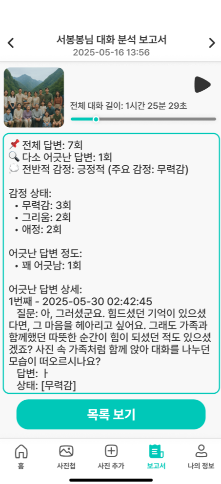
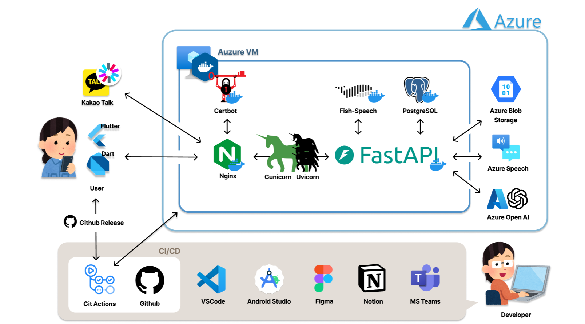
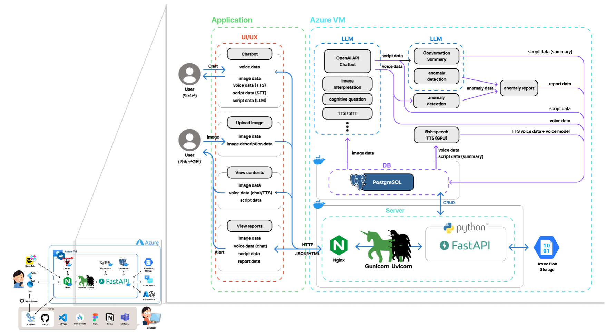

# 메멘토 박스



## 📌 프로젝트 개요
> 본 프로젝트는 어르신의 과거 사진을 기반으로 회상 대화를 유도하고, 해당 음성 및 텍스트 데이터를 분석하여 치매의 조기 징후를 비침습적으로 탐지하는 AI 기반 정서 돌봄 서비스입니다.<br/>
회상 대화를 통해 인지·정서 상태를 자연스럽게 평가하고, 보호자에게 이상 징후를 리포트 및 스토리 형태로 제공하는 것을 목표로 합니다.<br/>

## 🎯 주요 기능
- **가족 전용 커뮤니티** : family_id를 활용해 가족 간 회상 콘텐츠를 비공개로 공유하고 열람할 수 있는 공간 제공<br/>
- **보호자 알림 리포트 제공** : 대화 요약, 감정 상태, 발화 특성 등 분석 리포트 생성<br/>
- **스토리텔링 생성** : 대화 데이터를 활용하여 사진에 대한 스토리텔링 생성<br/>
- **Voice Cloning** : 환자의 음성데이터를 cloning하여 환자의 목소리로 스토리 읽어줌<br/>
- **회상 대화 기반 치매 조기 탐지** : 사진 기반 회상 대화를 통해 자연스러운 대화를 유도
  - voice -> text -> gpt -> text -> voice로 이루어지는 파이프라인을 통한 자연스러운 음성 대화 로직 구현

## 👀 How does it work?

<div align="center">
  
  
  
  
</div>

## ⚙️ Architecture





## 🛠️ 기술 스택
    <br/>


 
 
 


 


- **Azure OpenAI GPT-4o** : LLM 기반 회상 대화 질문 생성 및 회상 스토리 재구성
- **Fish-speech** : 파인튜닝된 노인 음성 합성 모델로, 감성적인 회상 대화를 실제 노인 목소리처럼 구현
- **Azure Speech**
    - STT: 어르신의 음성 발화를 텍스트로 변환해 LLM 입력으로 활용
    - TTS: GPT 응답 결과를 기본 음성으로 합성 (fish-speech 이전 단계)
- **Azure Blob Storage** : 이미지, 음성 파일 등 멀티미디어 파일 저장소로 활용
- **PostgreSQL + SQLAlchemy + Alembic** : 사용자, 가족, 대화, 사진, 리포트 등 서비스 전반의 관계형 데이터 관리 및 마이그레이션 처리
- **FastAPI + Uvicorn** : 백엔드 API 서버로, 사용자 인증, 음성 처리, 대화 저장 등의 주요 로직 구현
- **Docker**: astAPI, fish-speech, PostgreSQL 등을 컨테이너화하여 안정적 배포
- **Flutter**: 사용자용 모바일 앱 구현 (사진 업로드, 음성 대화, 리포트 확인, 커뮤니티 기능 등)
- **Kakao SDK**: 카카오 로그인 연동 및 사용자 인증 처리
- **Nginx + Certbot**: 보안 인증서 적용 및 리버스 프록시 서버 설정


<br/>

## 🗂️ 프로젝트 구조
### Backend
#### Fastapi
**`fastapi-app\app\`**
- `main.py`: FastAPI 서버 메인 엔트리포인트
- `db\models\`: DB 테이블 정의 (SQLAlchemy)
- `schemas\` : API용 데이터 모델 정의 (Pydantic)
- `routers\` : API 엔드포인트 정의
- `services\` : 비즈니스 로직 처리
#### Fish-Speech 
**`fastapi-app\fish-speech\`**
- `fish_main.py` : main 모듈
- `fish_module.py` : 추론 모듈
- `preprocessing.py` : 전처리 모듈

### Frontend
**`Front\lib\`**
- `screens\` : UI 화면 구성 
- `models\` : 도메인 객체 정의


### 🎥 시연영상 
- [📷 홍보영상 보기!](https://github.com/hongwon1031/MS_AI_project_3/blob/main/data/%EC%8B%9C%EC%97%B0%EC%9E%90%EB%A5%B8%EA%B1%B0.mp4)
### 자세한 내용은 [3차 프로젝트 PPT.pdf](https://github.com/hongwon1031/MS_AI_project_3/blob/main/data/3%EC%B0%A8%20%ED%94%84%EB%A1%9C%EC%A0%9D%ED%8A%B8%20PPT.pdf) 참고
### 🐶 How to use?
<p>$\huge{\rm{\color{red}\textbf{azure\ 리소스\ 삭제로\ 인해\ 현재\ 사용\ 불가능}}}$</p>

1. 모델 가중치 다운로드
  ```
  huggingface-cli download fishaudio/openaudio-s1-mini --local-dir checkpoints/openaudio-s1-mini
  ```
2. llama 가중치 변경 <br/>
  [파인튜닝 가중치 다운](https://drive.google.com/file/d/1yfSb8XzA4_2eyeGVyMGNqnSoboJuIGRA/view?usp=sharing)<br/>
  `fastapi-app\fish-speech\fish_module.py` 에서 `llama_checkpoint_path` 변수를 파인튜닝된 폴더로 변경
  ```
  llama_checkpoint_path = "checkpoints/fish-speech-1.5-yth-lora-8000"
  ```
3. 백엔드 서버 실행
  ```
  docker-compose up build
  ```
4. apk파일 생성
  ```
  flutter build apk --release
  ```
  `build\app\outputs\apk\debug\app-debug.apk` 파일을 통해 서버 실행

### Reference
- https://github.com/fishaudio/fish-speech